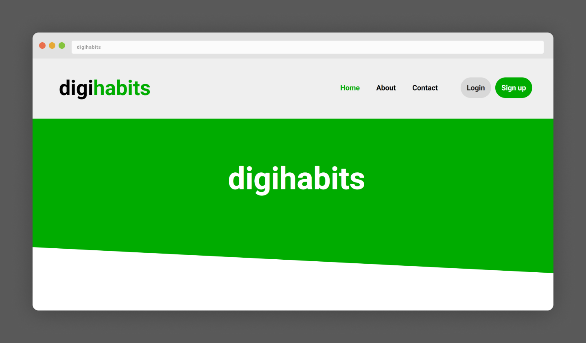
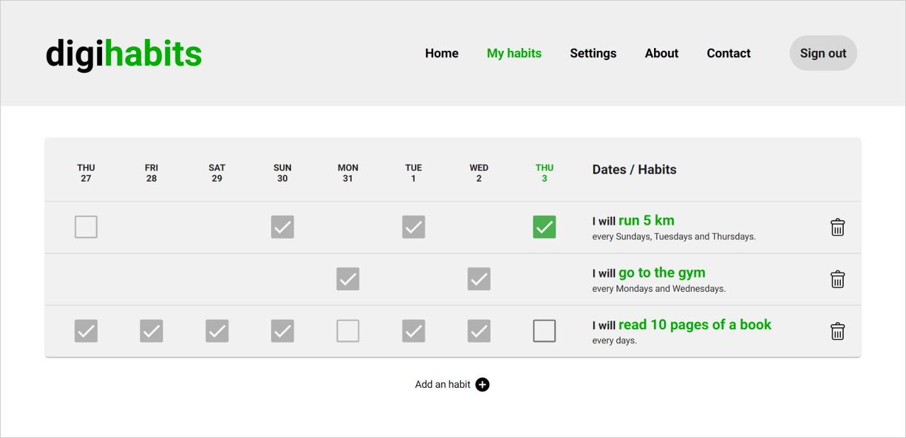
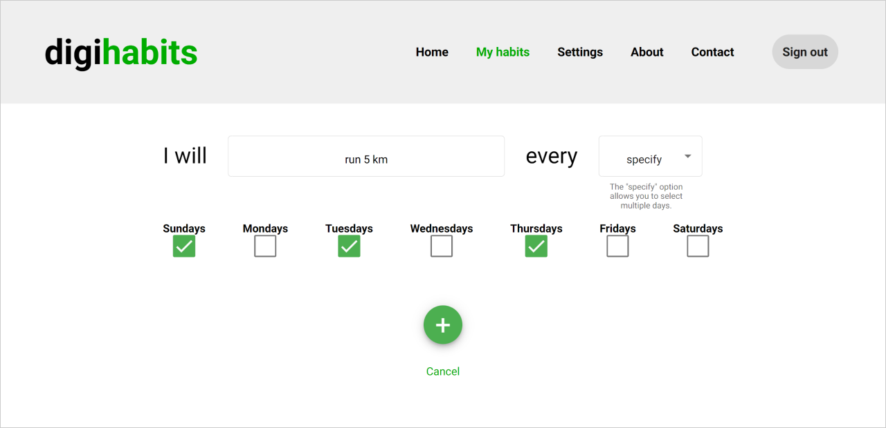
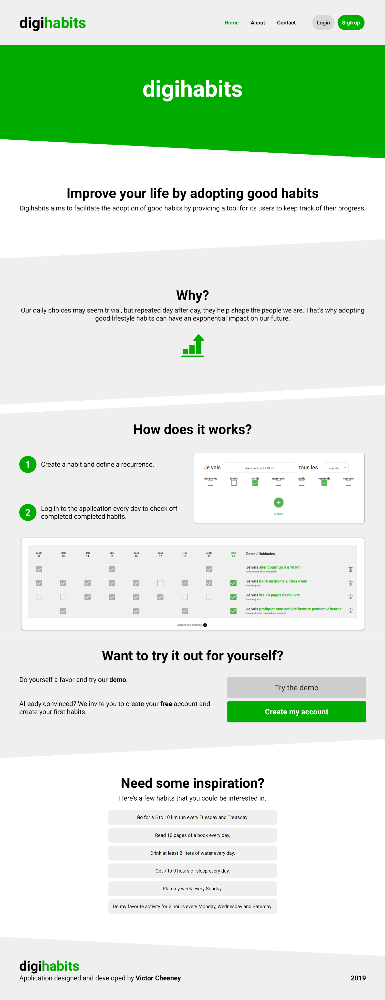
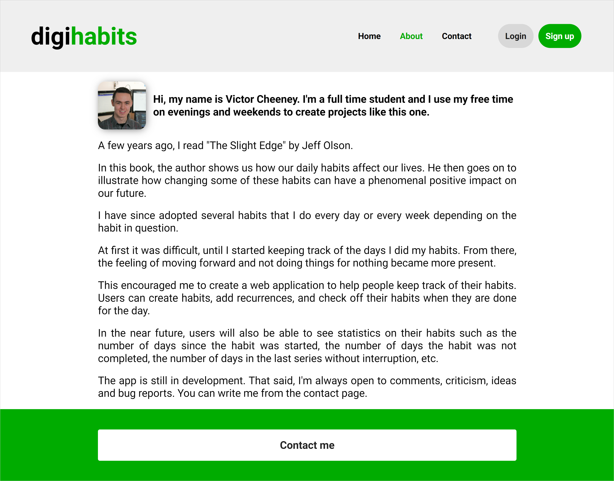
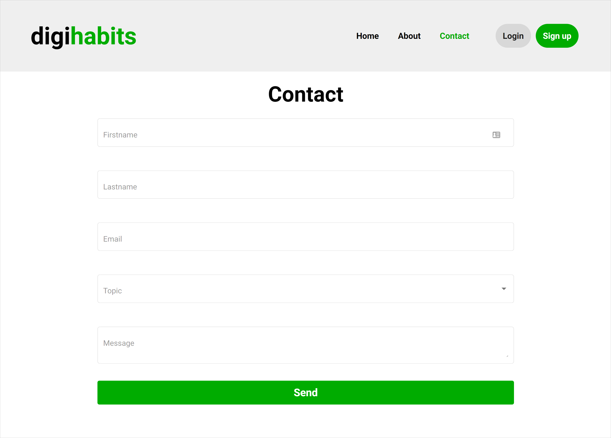

# ✔️ digihabits <a href="#-project-status"></a>

A habits tracker that helps its users implement good positive habits in their lives.

## Table of contents <!-- omit in toc -->

- [☀ Introduction](#-introduction)
- [📷 Preview](#-preview)
    - [Habits page](#habits-page)
    - [Create habit page](#create-habit-page)
    - [Landing page](#landing-page)
    - [About page](#about-page)
    - [Contact page](#contact-page)
- [💿 Setup](#-setup)
  - [Prerequisites](#prerequisites)
  - [Installation steps](#installation-steps)
  - [Usage](#usage)
- [🛠 Technologies Used](#-technologies-used)
- [🚦 Project Status](#-project-status)

## ☀ Introduction

The date was around January 2019. I was closing in on my college degree at Cégep de Victoriaville. The previous semester, I had a web development class where I got introduced to the MEAN stack (MongoDB, Express, Angular, NodeJS). I had a feeling that I did not fully grasp the material yet, so I wanted to create a side project to get more experience with those new javascript technologies that seemed so magical yet challenging at the same time. ✨

As I was reading a lot of self-development books at that time. I thought that building a habits tracker could serve me well to keep me on track with my reading schedule.

## 📷 Preview

#### Habits page

The habits page displays the user's habits and past 8 days' entries. If a user completes a habit on a day he can log in and mark ✔ it completed. The actual day is highlighted in the green primary colour.



#### Create habit page

The habit creation page allows a user to create a habit. He enters his habit description in the text field and selects the days he wants to complete that habit in the dropdown. There is a "Specify" option in case the user wants to select many different days throughout the week.



#### Landing page

The homepage is all about trying to convince the user that he should care about his daily habits and how this application might help him do so.



#### About page

The about page provides information about what got me interested in starting this project.



#### Contact page

It used to allow users to send me messages when the app was in production.



## 💿 Setup

### Prerequisites

- [NodeJS v10.24.1](https://nodejs.org/en/)

> 🚨 As I spent some setting back up this project on my machine in February 2022 to polish this README, I encountered a package incompatibility with NodeJS +16. Therefore, it is very important to use the aforementioned NodeJS version above. If you're on Windows, I suggest using [nvm-windows](https://github.com/coreybutler/nvm-windows) by Corey Butler. On MAC or Linux, you can use the traditional [NVM](https://github.com/nvm-sh/nvm).

### Installation steps

Run the following commands to install the project:

```sh
# Clone the project in a directory of your choice
$ git clone git@github.com:vcheeney/digihabits.git

# Move into the project directory
$ cd digihabits

# Create the .env file from the template
# You can edit the values if you wish but defaults will work fine.
$ cp .env.example .env

# Install the project dependencies
$ npm install

# Build the project
$ npm run build
```

### Usage

In one terminal, start the database with the following command and leave the terminal running until you would like to shut the DB down.

```sh
# Start the database
$ docker-compose up
```

In another terminal, run the following command:

```sh
# Start the application
$ npm start
```

Access the Angular app at http://localhost:3000/

If you would prefer to run the development environment, run the two following commands in two different terminals:

```sh
# Run the development server
$ npm run server
```

```sh
# Serve the Angular app in development mode
$ npm run dev
```

Access the Angular app in development mode at http://localhost:4200/

## 🛠 Technologies Used

- [**M**ongoDB 3.6.3](https://docs.mongodb.com/v3.6/) - NoSQL database system
- [**E**xpress 4.16.4](https://expressjs.com/en/4x/api.html) - NodeJS web framework
- [**A**ngular 7](https://v7.angular.io/docs) - Frontend web framework
- [**N**odeJS 10](docs_url) - JavaScript Runtime

## 🚦 Project Status


I put this project on pause in April 2019 as my college internship was draining most of my coding energy... 😂 I freshened it up a bit the following October as I was applying for my first university internship and wanted to get a more modern web dev position. Once I got in and got introduced to React, I got absorbed in this new framework and wanted to move on to new ideas. 💡

A year later, I started the [🛒 Pricebook](https://github.com/vcheeney/pricebook) project.
